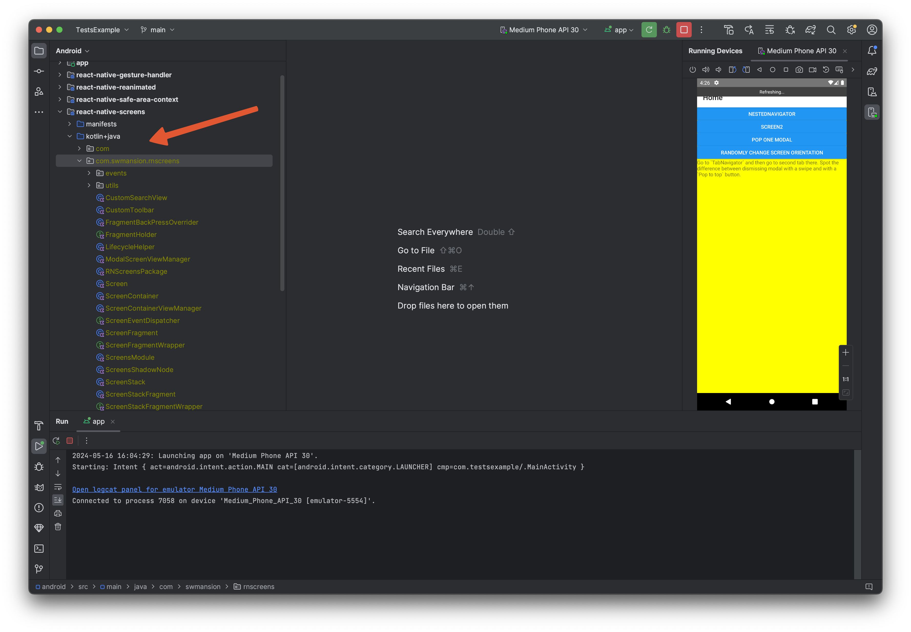
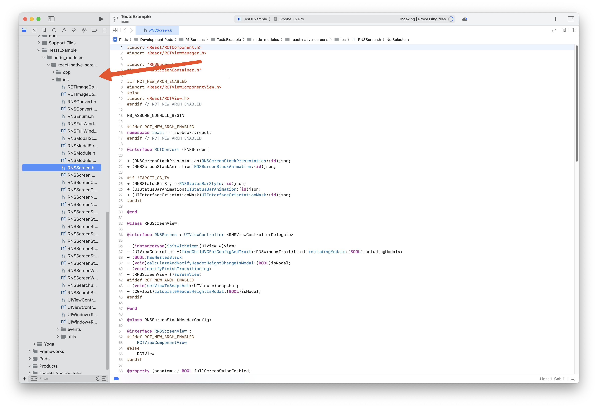

# Contributing to react-native-screens

## Welcome!

Thank you for considering contributing to `react-native-screens`. It's people like you that make open source projects thrive! We love to receive contributions from our community and there are many ways for *you* to be a part of this. 

### Found a bug?

If you’ve encountered a bug, don't hesitate to submit [an issue](https://github.com/software-mansion/react-native-screens/issues). Just check if someone didn't report it lately.

When filing an issue, make sure to provide:
- a short description of the problem
- an operating system that you are currently working on
- what happened
- what you expected to happen
- **snippet of code or Snack that reproduces the bug**. Check out [this guide](https://stackoverflow.com/help/minimal-reproducible-example)
- version of `react-native` and `react-native-screens` 

### Got a question or an idea for a feature?

We use GitHub issues exclusively for tracking bugs. For questions and feature requests check out [Discussions](https://github.com/software-mansion/react-native-screens/discussions).

We've provided a template on GitHub that simplifies the process of filing an issue.

Following these few steps will show great respect for the time of the developers managing and developing this open-source project.

We inform you that unrespectful issues will be closed.

## Ways to Contribute

1. **Replying and handling open issues** &ndash; great way to contribute without writing a single line of code is triaging the issues. We often get issues that have generic errors, occur only in very specific cases, do not have proper example or reproducible repository. One of they way to help is preparing and filling those details, which will help other contributors get up to speed with the issue faster. 

2. **Reviewing pull requests** &ndash; reviewing Pull Requests is crucial as it may help catch the corner cases or bugs that the developer did not notice. Every review matters as it may help polish quality of the library.

3. **Contributing to Code** &ndash; code-level contributions generally come in the form of pull requests. By contributing to code you help us with solving issues, fixing bugs or introducing new amazing features. If you want to start your adventure with open source it's good idea to take a look at [good first issue](https://github.com/software-mansion/react-native-screens/pulls?q=is%3Apr+is%3Aopen+label%3A%22good+first+issue%22) on GitHub. Read more about [contributing to code](#contributing-to-code). 

### Repository overview 

- `android` &ndash; source code of Android native implementation
- `common` &ndash; C++ code related to components - shadow nodes and state
- `cpp` &ndash; C++ code for turbo modules
- `Example` &ndash; paper version of React Native mobile example app
- `FabricExample` &ndash; fabric version of React Native mobile example app 
- `FabricTestExample` &ndash; fabric version of React Native mobile app containing test examples
- `gesture-handler` &ndash; interop between react-native-screens and react-native-gesture-handler
- `guides` &ndash; guides for developers
- `ios` &ndash; source code of iOS native implementation
- `native-stack` &ndash; native stack v5, this will be deprecated in favor of react-navigation in near feature
- `react-navigation` &ndash; git submodule containing react-navigation
- `reanimated` &ndash; interop between react-native-screens and react-native-reanimated
- `scripts` &ndash; cli utils 
- `src` &ndash; JS core code 
- `TestsExample` &ndash; paper version of React Native mobile app containing test examples
- `TVOSExample` &ndash; React Native for TVOS app wrapper for shared example code
- `windows` &ndash; react-native-screens support for Windows 

## Handling open issues 

Often understanding and reproducing the problem can be very time consuming task. The great way to help other contributors get up to the speed with solving an issue is providing detailed description and *reproducible* example. The github already has an template for creating issue, nevertheless we still encounter issues that do not have all necessary details, like:

- repository that we can clone and quickly see the problem,
- very generic reproduction steps,
- missing description,
- not related or truncated stack trace. 

What you can do is ask the owner for those details or try provide them by yourself - try to reproduce the problem and provide missing details, so other developer can start debugging straightaway! 🎉

## Contributing to Code

Posting Pull Requests to the issues is great way to contribute to Reanimated. If you eager to start contributing right away, we have list of [good first issue](https://github.com/software-mansion/react-native-screens/pulls?q=is%3Apr+is%3Aopen+label%3A%22good+first+issue%22) that contain bugs which have limited scope. In this section we'll describe in more details how to play around with react-native-screens setup. 

> [!tip]
> For commits and pull request names we follow a [Conventional Commits](https://www.conventionalcommits.org/en/v1.0.0/) specification.

We have two types of applications: Example (Example, FabricExample) and TestsExample (FabricTestExample, TestsExample), the first work as a showcase of the library, the latter contains specific test cases that corresponds to github issues. For example Test1864.tsx corresponds to issue [#1864](https://github.com/software-mansion/react-native-screens/issues/1864). Our developer flow usually consists of creating new `Test*.ts` with code example that we try to fix or add. For the new features we try to prepare showcases in Example app.  

- `Example/src` &ndash; source code with showcase app for paper architecture
- `TestsExample/src` &ndash; source code with tests example app for paper architecture
- `FabricExample/src` &ndash; source code with showcase app for fabric architecture
- `FabricTestExample/src` &ndash; source code with tests example app for fabric architecture
- `TVOSExample/src` &ndash; source code with example app for TVOS
- `src` &ndash; contains JS core code
- `android` &ndash; source code related to Android native part
- `ios` &ndash; source code related to iOS native part

### Working on Android

To start with, let install all dependencies:

1. `yarn`
2. `yarn submodules`
3. `cd TestsExample`
4. `yarn`
5. `yarn start` &ndash; make sure to start metro bundler before building the app in Android Studio

and open `react-native-screens/TestsExample/android` with Android Studio.

The native source code of react-native-screens can be found in `react-native-screens` module, in `kotlin+java/com.swmansion.rnscreens`. Making sure metro builder is run, you can now build React Native app or debug native code. 

### Working on iOS

To start with, let install all dependencies:

1. `yarn`
2. `yarn submodules`
3. `cd TestsExample`
4. `yarn`
5. `(cd ios && pod install)`
6. `yarn start` &ndash; make sure to start metro bundler before building the app in XCode.

and open `react-native-screens/TestsExample/ios/TestsExample.xcworkspace` with XCode.

To find the native source code of Reanimated navigate to `Pods > Development Pods >  RNScreens > TestsExample > node_modules > react-native-screens > ios`. Making sure metro builder is run, you can now build React Native app or debug native code. 

### Fabric 

When using fabric on iOS codegen is run while doing `pod install`, on android when running Fabric Example in Android Studio. Alternative approach for Android is to go into `./FabricExample/android` folder and run `./gradlew generateCodegenArtifactsFromSchema`. Next you need to copy changed files from `/android/build/generated/source/codegen/java/com/facebook/react/viewmanagers/` to `android/src/paper/java/com/facebook/react/viewmanagers/`, so the interfaces are in sync. 

### Preparing Pull Request

When your code changes are ready, it is time to open your Pull Request. Github already has a template that helps you properly post your changes. The most crucial are:

1. **Description**:
 - If you're solving specific issue, start with linking it.
 - Write what are your motivations. 
2. **Changes** - write what you have changes and why.
3. **Screenshots / GIFs** &ndash; if applicable it's great idea to attach screen or video before and after changes.
4. **Test code and steps to reproduce** &ndash; describe how others can test your change, if you didn't add `Test*.tsx` file it's good idea to add code snippets here. 

### Do I need to prepare Pull Request for react-navigation too? 

Currently native stack is both in `react-native-screens` and `react-navigation`. `react-native-screens` contains native-stack v5 (`/native-stack`), newer versions (v6, v7) are moved to `react-navigation`, hance in some cases it is necessary to prepare pull request for `react-navigation` alongside the `react-native-screens` changes. 

> [!CAUTION]
> Currently, in this setup we have some code duplications, we planing soon to deprecate native-stack v5 and remove it from react-native-screens

#### Changes in native code 

If your change is only related to native code, for example you're fixing a bug, you **do not need** to post PR to `react-navigation`. `react-native-screens` is separate library installed alongside `react-navigation`, you can just bump `react-native-screens` version in you package.json file.

#### Changes in JS code or both

If you're changing native-stack v5 (`./native-stack`) you **do not need** to post PR to `react-navigation`.

If you're changing native-stack v6, v7 you **need to** post PR to `react-navigation`, as the code belongs there now.

If you're changing core functionality:
- If it's a bug fix and does not change the interface then you **do not need** to post PR to `react-navigation`.
- If you're adding new feature or changing API you **need to** post PR to `react-navigation`.

> [!TIP]
> As the rule of thumb, if you're changing the external interface you need to prepare PRs for react-navigation

### What is the flow to integrate with react-navigation

When you propose the changes that require posting PR to react-navigation. Please follow those steps:

1. Create PR with `react-native-screens` changes
2. Create PR that changes the native-stack in `react-navigation`
3. Wait for both to pass the review and have all all checks passed
4. Merge `react-native-screens` changes
5. Merge `react-native-navigation` changes
6. Bump the version of main branch index ref in `react-native-screens` 
7. Post and merge ASAP the main branch ref bump of `react-navigation`

> [!WARNING]
> Those steps are crucial, if you change the API in react-native-screens and won't merge react-navigation changes the libraries may go out of sync and crash i.e. because of not existing property. On the other hand, if you don't perform step 6 and 7, test examples and showcase app may stop working in react-native-screens.

See you on GitHub! 🎉